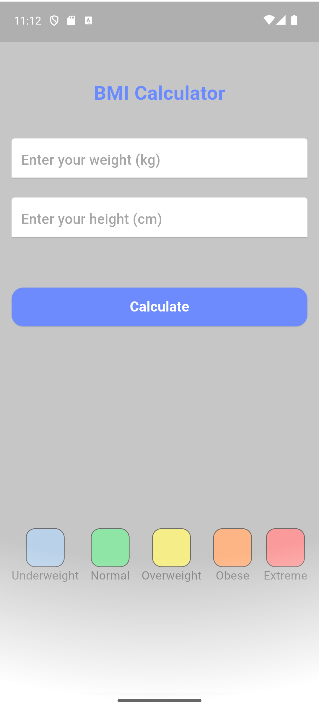

# ⚖️ BMI Calculator

A simple, clean Flutter app that calculates your Body Mass Index and shows the result with colour‑coded health categories.

## ✨ Features

- Enter your **weight (kg)** and **height (cm)**.
- Calculates **BMI = weight ÷ (height in m)²** on a tap.
- Shows the result in a **colour‑coded card** that reflects your category:

| Category | BMI range | Colour |
|---|---|---|
| Underweight | &lt; 18.5 | 🔵 Blue |
| Normal | 18.5 – 24.9 | 🟢 Green |
| Overweight | 25 – 29.9 | 🟡 Yellow |
| Obese | 30 – 34.9 | 🟠 Orange |
| Extreme | ≥ 35 | 🔴 Red |

- A category legend is shown at the bottom for quick reference.

## 📱 Screenshot



## 🛠️ Tech

- **Flutter** (Material Design)
- Componentised UI: `BMIInputs`, `BMIResult`, `BMICategory`

## 🚀 Run it

```bash
flutter pub get
flutter run
```
